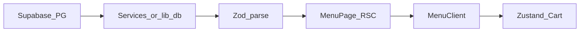

# Menu Data Flow (Restaurant OS)

Краткое описание потока данных для страницы меню: от источника до корзины. Согласовано с [menu_page.md](menu_page.md), [zod_schemas.md](zod_schemas.md), [blueprint.md](blueprint.md).

## Пилотный тенант

- **Slug:** `plovxana`
- **Маршрут меню:** `/[slug]/menu` (например `/plovxana/menu`)
- **Изоляция данных:** все строки меню привязаны к тенанту через **`tenant_id`** (см. [database_schema.sql](database_schema.sql))

## Реализация в коде (текущий репозиторий)

- Supabase SSR (сессия, админка): [`lib/supabase/server.ts`](lib/supabase/server.ts)
- Тенант по slug: [`lib/tenant/getTenant.ts`](lib/tenant/getTenant.ts) (опционально резолв по поддомену)
- Меню: [`services/menu/getMenu.ts`](services/menu/getMenu.ts) → Zod в [`lib/validation/menu.ts`](lib/validation/menu.ts)
- **Публичное чтение меню для кэша:** внутри `getMenu` используется [`lib/supabase/anon-server.ts`](lib/supabase/anon-server.ts) (anon, без `cookies`) + `unstable_cache` и теги [`lib/cache/tags.ts`](lib/cache/tags.ts) — так Data Cache Next.js остаётся корректным (в колбэке кэша нельзя вызывать `cookies()`).
- **Стоп-лист (staff):** Server Action [`app/actions/menu.actions.ts`](app/actions/menu.actions.ts) — `createSupabaseServerClient()` и RLS, не `service_role`. После успеха — `revalidateTag`. UI: [`app/admin/(protected)/menu-editor/page.tsx`](app/admin/(protected)/menu-editor/page.tsx), [`components/admin/MenuKillSwitchList.tsx`](components/admin/MenuKillSwitchList.tsx).
- **Realtime на витрине:** [`components/menu/MenuClient.tsx`](components/menu/MenuClient.tsx) — `postgres_changes` по `menu_items`, миграция [`supabase/migrations/20260424_0008_menu_realtime.sql`](supabase/migrations/20260424_0008_menu_realtime.sql).
- Страница: [`app/[slug]/menu/page.tsx`](app/[slug]/menu/page.tsx) (`revalidate = 30`), UI: [`components/menu/MenuClient.tsx`](components/menu/MenuClient.tsx)
- Мост к iiko: [`services/iiko/getIikoMenu.ts`](services/iiko/getIikoMenu.ts) + [`iiko_adapter/main.py`](iiko_adapter/main.py)

## Поток v1 (Supabase → UI)

1. **Источник:** PostgreSQL (Supabase), таблицы `categories`, `menu_items` (и при необходимости модификаторы).
2. **Сервер:** RSC загружает данные через `getTenantBySlug` + `getMenu` (не из UI напрямую).
3. **Валидация:** ответ БД прогоняется через Zod-схемы из контракта `lib/validation/schemas.ts` (по [zod_schemas.md](zod_schemas.md)).
4. **UI:** в `MenuClient` (`"use client"`) — фильтры по категориям, карточки, анимации.
5. **Корзина:** клиентское состояние (Zustand, по blueprint), расчёт суммы и модификаторов — в доменном слое, не в разметке.

При ошибке парсинга Zod: логирование, пустое меню или дружелюбное сообщение — без падения всей страницы.

## Поток v2 (опционально: iiko)

Синхронизация номенклатуры/заказов с iiko — отдельный адаптер (например FastAPI). Браузер и публичный Next **не** обращаются к iiko напрямую; после синка источником для меню остаётся та же БД (или согласованный кэш).

## TanStack Query

Если меню частично подгружается или обновляется на клиенте (ревалидация, «живое» меню), на диаграмме ниже добавляется ветка: `MenuClient` → `useQuery` → `GET /api/...` → сервис → Supabase.

## Диаграмма (текущий целевой v1)

## Связь с JSON-LD и контактами

Контент заведения (адрес, часы, телефоны) для SEO и футера — из раздела «Текущий сайт / пилотный тенант» в [blueprint.md](blueprint.md); меню — отдельный домен данных, но тот же `tenant_id` / slug.
